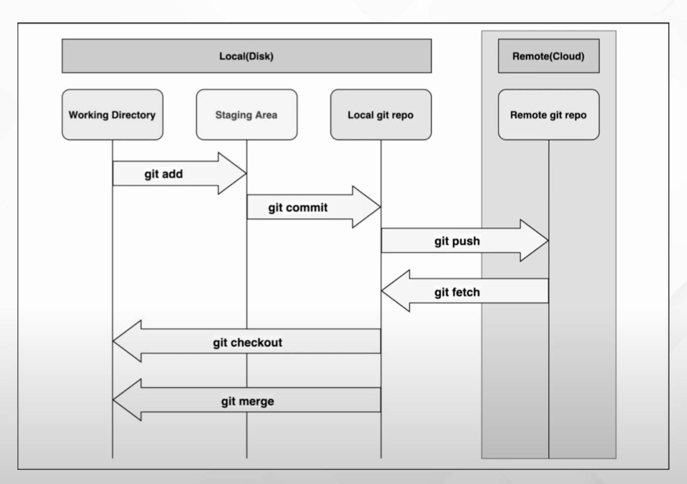

>[DIAPOSITIVAS](S3-recursos/introduccion-git.pdf)

---

**GIT** es una herramienta de control de versiones que permite a varios desarrolladores trabajar sobre un mismo proyecto. GIT tiene un control absoluto de todos los cambios que se han realizado en el proyecto, lo que nos ayuda en caso de error, ya que podemos volver a versiones en las que no existía el fallo y ver los cambios que lo han producido.

La principal ventaja de GIT es que funciona de manera descentralizada. A la hora de iniciar un proyecto, nos descargamos un clon de lo que hay en el servidor, permitiendo seguir trabajando si el servidor llega a tener un problema.

**FLUJO DE TRABAJO**

Vamos ahora a explicar el flujo de trabajo de GIT, para ello prestaremos especial atención al siguiente diagrama:

- Nosotros al iniciar un proyecto, estaremos trabajando en **local**, modificando, creando y eliminando archivos
- Muchos de estos cambios serán susceptibles de ser subidos a nuestro **repositorio local**, para posteriormente, sincronizarlo con el **repositorio remoto**
- Todos estos cambios que hemos comentado que son susceptibles, pasan a una **fase stage** (git add). Una vez estemos en esta fase, verificaremos que ficheros queremos subir y realizaremos un git commit a nuestro **repositorio local**
- Para subirlo al r**epositorio remoto** usaremos un git push, esto podrá ser después de varios commits en local, agrupando y subiendo el contenido modificado
- Con otros comandos (git pull, git fetch…) podremos a su vez descargarnos los cambios realizados por otros desarrolladores

Siempre que hablamos de repositorio en cloud nosotros trabajaremos con GitHub que veremos más adelante
